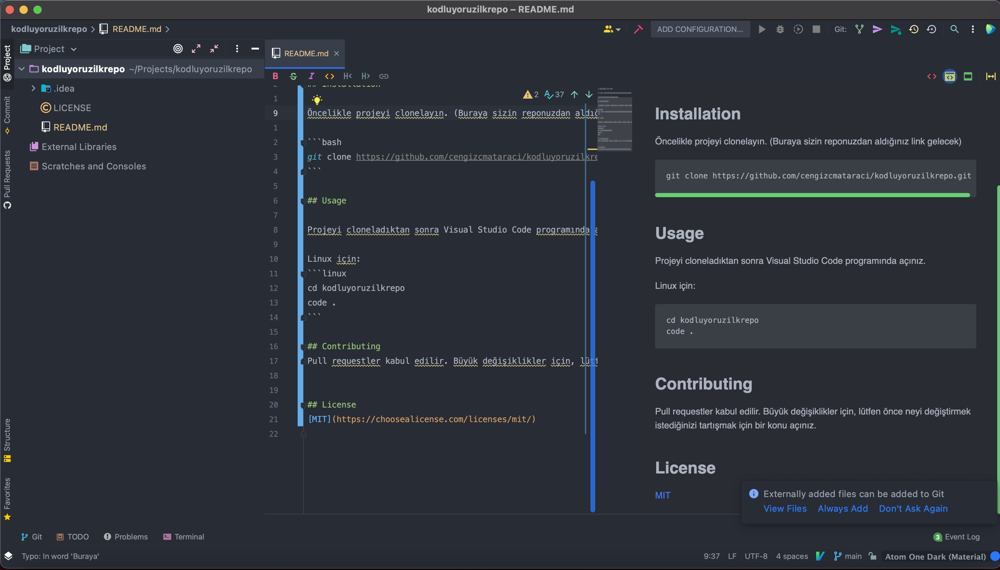

# Kodluyoruz Ilk Repo

Bu repo [Kodluyoruz](https://www.kodluyoruz.org) İOS Eğitiminde oluşturduğumuz ilk repo. İçerisinde bir adet README dosyası, bir adet de index.html barındırıyor.



## Installation

Öncelikle projeyi clonelayın.

```bash
git clone https://github.com/mehmetaliakbay/kodluyoruzilkrepo
```

## Usage

Projeyi cloneladıktan sonra Visual Studio Code programında açınız.

Linux için:
```linux
cd kodluyoruzilkrepo
code .
```

## License
[MIT](https://choosealicense.com/licenses/mit/)
